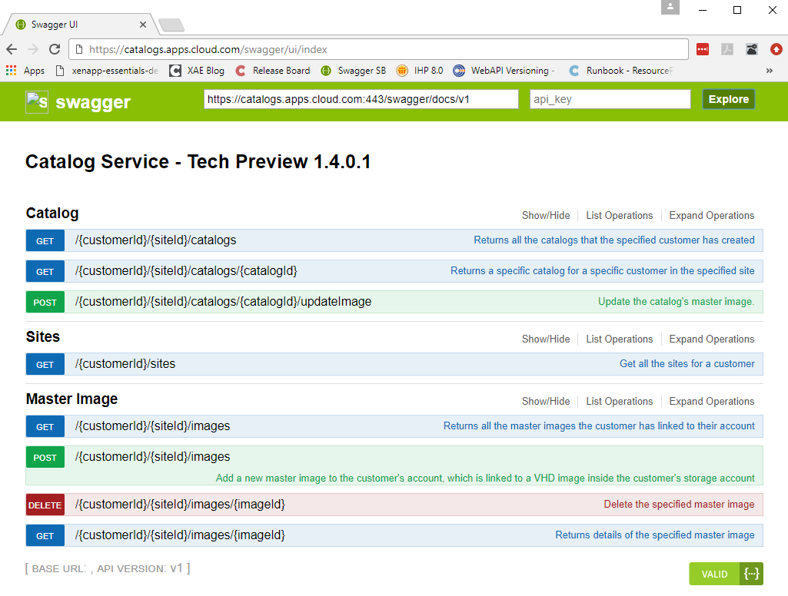

===================================
Catalog Service APIs - Tech Preview
===================================

Catalog Service provides a set of REST APIs that can be used to automate updating a catalog's master image or manage catalog applications.
The complete set of available APIs can be viewed and tried out at `Catalog Service APIs <https://catalogs.apps.cloud.com/swagger/ui/index>`_.

|figure_1|

.. toctree::
   :maxdepth: 2
   
   prerequisites
   how_to_get_a_site_id
   how_to_add_a_master_image
   how_to_get_a_master_image
   how_to_get_all_master_images
   how_to_delete_a_master_image
   how_to_get_catalog_information
   how_to_get_details_of_all_the_catalogs
   how_to_deploy_a_catalog
   how_to_update_a_catalog_image
   how_to_get_all_catalog_applications
   how_to_publish_catalog_applications
   how_to_update_a_catalog_application
   how_to_unpublish_catalog_applications
   how_to_extract_an_app_icon
   
Comments
========

.. disqus::

