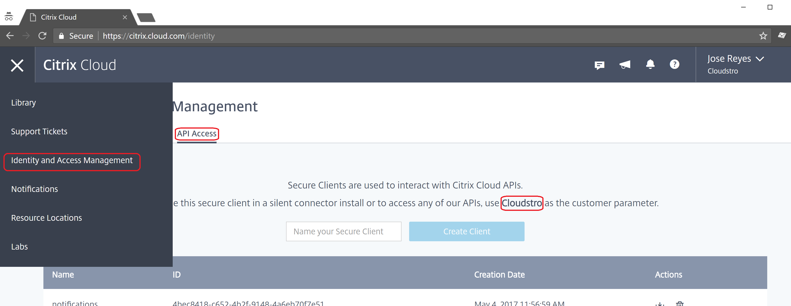

===========
Customer Id
===========

Citrix Cloud API requires a ``customer`` id when calling REST APIs, as part of
the URL. The parameter sometimes must be the special value ``root``.
But sometimes you need the specific ``customer`` that you are targetting.

To get the ``customer`` id, use the API Client tab on the Identity and Access
Management page:

|figure_1|

Comments
========

.. disqus::
